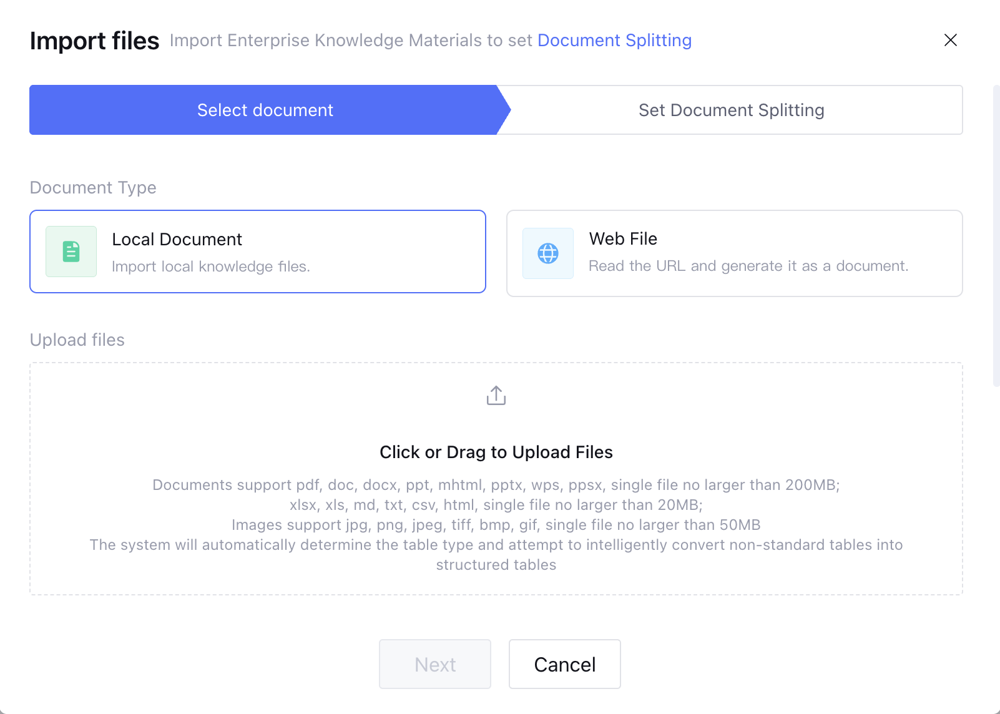
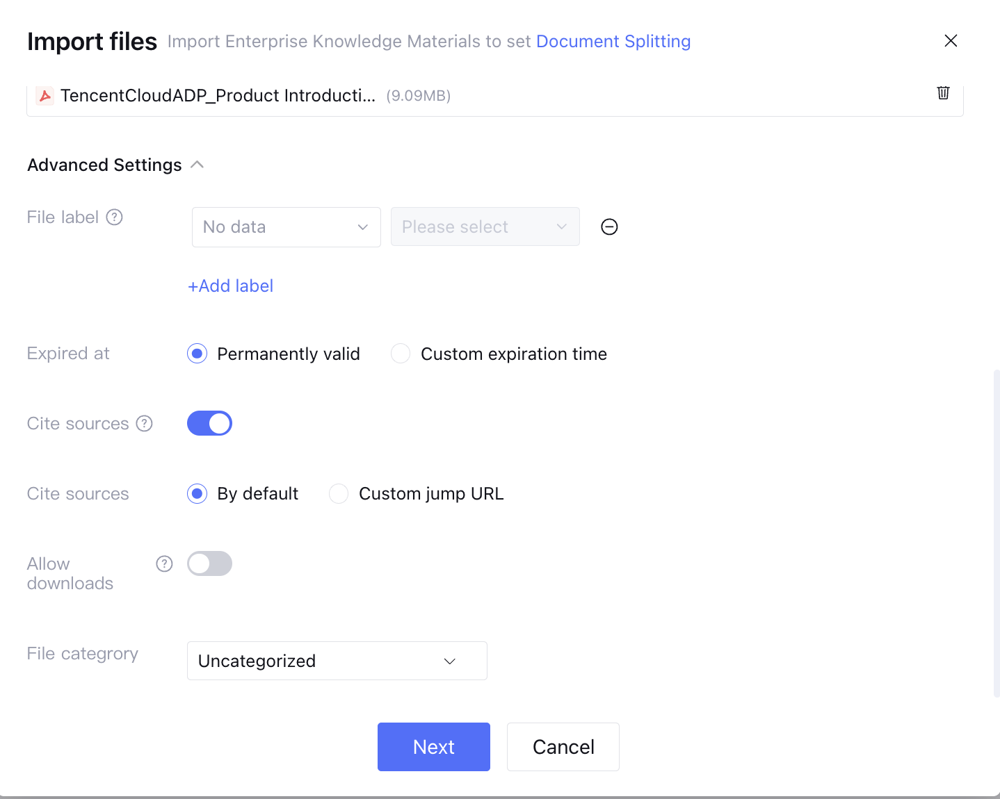
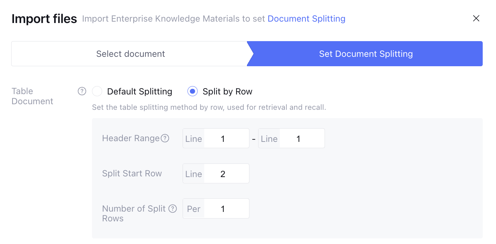
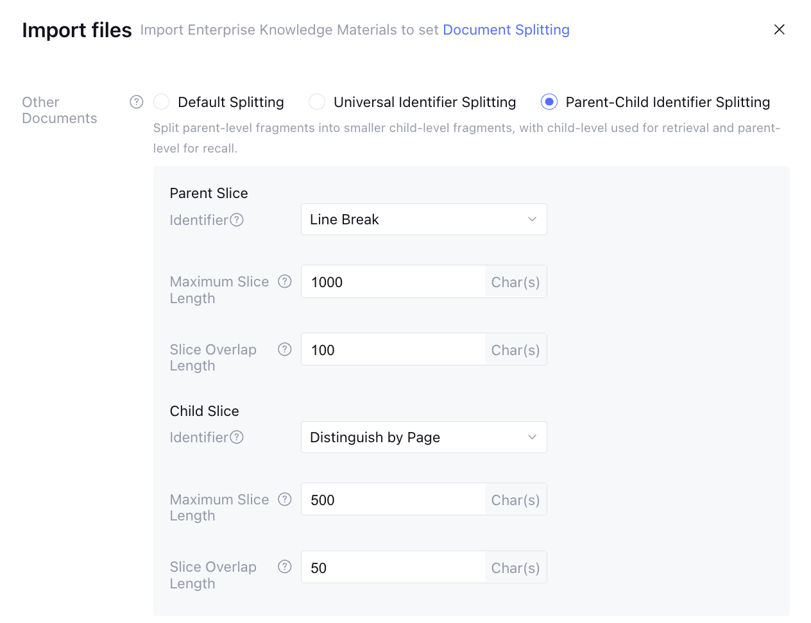
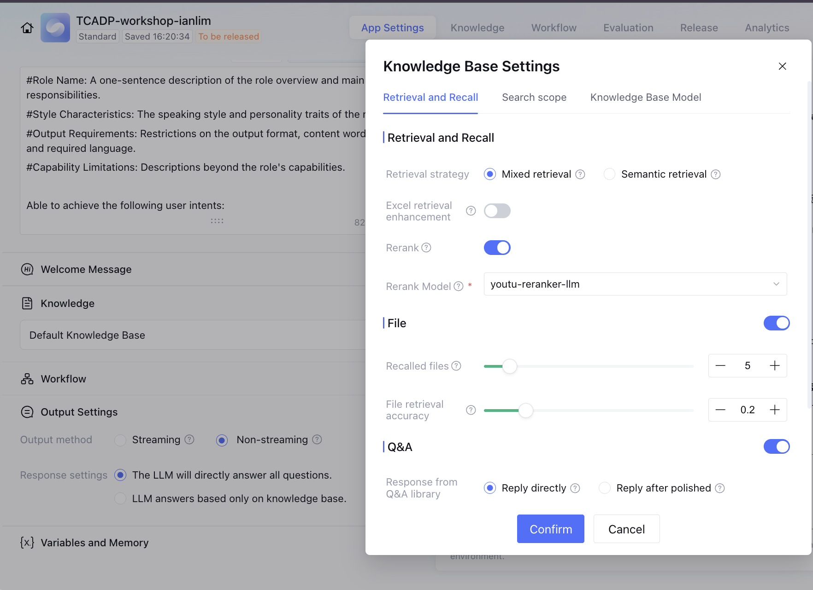
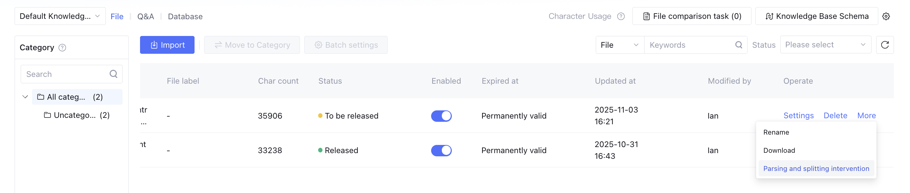
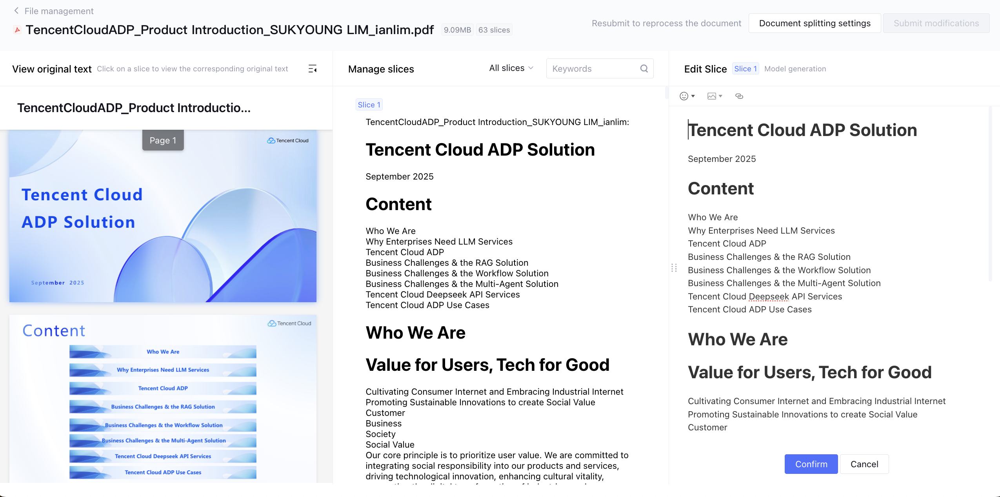

# 🧠 Knowledge Base Workshop

## 0) 왜 이 랩을 하나요? (문제의식 → 해결)
실무에서 모델이 “그럴듯하지만 근거 없는” 답을 내놓는 이유는 간단합니다. **모델이 알아야 할 문서들과 연결이 느슨**하기 때문이죠. 
이 랩은 두 가지 길로 이 문제를 해결합니다:

1) **콘솔 경로(손으로 익히기)**: 파일을 올리고 색인 옵션을 만지며, **출처(Reference Sources)**가 어떻게 달라지는지 감각을 잡습니다.
2) **Python 경로(자동화로 굳히기)**: 동일 앱을 **Python 예제 스크립트**로 호출해 **JSON 응답과 인용**을 강제하고, 파이프라인에서 **검증 가능한 흐름**을 구성합니다.

---

## 1) 멘탈 모델: ADP의 지식 흐름을 머릿속에 그려보기
- **업로드(문서/표/스냅샷/Q&A)** → **파싱/청킹/색인** → (질문 시) **검색/Rerank** → **생성(답변+인용)**
- **Mixed 검색**은 키워드·벡터를 함께 써서, 숫자/코드/SKU 같은 “정확 단어”와 “의미 유사성”을 동시에 잡습니다.
- **청크 크기(예: 800–1200)** 와 **오버랩(예: 100–200)** 은 *“한 번에 가져올 맥락의 폭”* 을 조절합니다. 너무 작으면 문맥이 끊기고, 너무 크면 Noise 가 늘어납니다.
- **Reference Sources**는 말 그대로 “답의 근거 문서/위치”를 보여줍니다. 응답에 신뢰를 더하고, 운영자 관점의 **디버깅 인사이트를** 추가 합니다.

---

## 2) 준비물 & 환경 세팅
- ADP 활성화 계정과 모델 쿼터(예: `deepseek-r1`)
- 터미널에서 아래 커맨드를 입력해서 환경을 셋팅합니다.
  ```bash
  export ADP_BASE_URL="https://api.lkeap.tencentcloud.com/v1"
  export ADP_API_KEY="YOUR_ADP_API_KEY"   # 발급 키로 교체
  export ADP_MODEL="deepseek-r1"
  ```

**문서/이미지 업로드 제한 (운영 매뉴얼 기준)**
- 문서 업로드 지원 형식: **doc, docx, ppt, pptx, pdf, txt**
- 단일 문서 제한: **최대 15MB / 최대 1,000페이지**
- 이미지 업로드 지원 형식: **jpg, jpeg, png, bmp** (단일 업로드, 가로·세로 **2,000px 이내**)
- 대화(챗) 화면에서도 파일 업로드 기반 Q&A를 지원합니다.
> 실무 팁: 제한을 넘는 대용량 문서는 **분할 업로드** 또는 **요약 스냅샷 생성** 후 업로드가 성능에 유리합니다.

**자주 하는 실수**
- `Bearer` 접두사 누락, `/v1` 경로 오타, 모델명 오타

---

## 3) 콘솔 경로 — 손으로 이해하는 색인과 인용
> 이 절의 목표는 *“파일 업로드 시 ADP 내부 처리(파싱/청킹/색인/검색/인용)”* 를 **체계적으로 이해**하는 것입니다.

### 3-1. 앱 선택/생성
ADP Console → **Application Management**에서 새 앱을 만들거나 기존 앱을 선택하세요. 이름은 *“kb-lab”* 정도로 간단히.

### 3-2. Knowledge Management: 파일을 올릴 때의 생각의 흐름
콘솔의 **Knowledge** 화면에서 다음 작업을 지원합니다: **문서 가져오기(웹/로컬)**, **문서 다운로드**, **문서 삭제**. 업로드한 문서는 파싱/청킹/색인 과정을 거쳐 질의 시 검색–재랭크–생성 단계에서 참조됩니다. 

- **PDF** [Construction_Guide_ Data+AI_Enabled_Next_Gen_Data_Intelligence_Platform.pdf](./../../samples/materials/Construction_Guide_%20Data+AI_Enabled_Next_Gen_Data_Intelligence_Platform.pdf) — 정책/표/일러스트가 섞인 문서형 지식 검증용
- **CSV** [Product_Catalog_Snippet.csv](./../../samples/materials/Product_Catalog_Snippet.csv) — SKU/가격 등 표 기반 정답 검증용 (시트/헤더 정합성 중요)
- **XLSX** [Store_Locations.xlsx](./../../samples/materials/Store_Locations.xlsx) — 시트/열 이름을 명확히, 빈 행 최소화 권장
- (선택) **DB 스냅샷** — 6장에서 만든 `products_snapshot.md`를 올려 제품 설명 질의 보강

> 참고: 콘솔의 **문서 가져오기**는 웹 콘텐츠 가져오기와 로컬 파일 가져오기를 모두 지원합니다. 대화 창(챗)에서는 파일 업로드 후 곧바로 Q&A 대화를 시작할 수 있습니다.


### 3-2-a. 색인 옵션(콘솔 **Advanced Settings**) — 운영 가이드 반영 빠른 세팅

- **Retrieval Strategy**: `Mixed Search`(키워드+벡터) 권장. 필요 시 `Semantic retrieval` 단독도 가능.
- **Excel Retrieval Enhancement**: (엑셀/표 질의 강화) **On** 권장 — SKU/코드/숫자 질의 정밀도 개선.

- **Top‑N(검색 결과 개수)**: *문서* top‑N 기본 5(최대 10), *Q&A* top‑N 기본 3(최대 5) — 우선 기본값으로 시작.
- **Matching Accuracy(매칭 임계치)**: 기본값에서 시작 → 인용 누락/잡음 시 점진 조정.
- **Splitting Documents(문서 분할)**:
  - `max slice length` / `slice overlap length` 지정 가능.
  - Parent/Child 두 레벨로 **길이/겹침**을 각각 줄 수 있음.
  - 표(XLSX/CSV)는 **행 단위 분할 규칙** 별도 지원.
  
- **사후 조정**: 업로드 후 **More → Re‑split / Re‑index**로 규칙 재적용 가능.
  

### 3-2-b. 어디서 무엇을 고르나 (콘솔 메뉴 경로 → 옵션)
> 아래 경로만 따라가면, 위의 **권장 시작값**(Mixed/Top‑N/Matching/Chunk/Overlap/Excel 강화/사후 조정)을 그대로 재현할 수 있습니다.
- **Retrieval/Top‑N/Matching/Q&A Top‑N/인용 표시**  
  경로: **Application Management → (앱 선택) → Application Configuration → Dialogue Test → Retrieval policy settings**  
  설정: 
  - *Text retrieval mode* = **Mixed**(또는 *Semantic*)
  - *Number of documents recalled* = **5**(기본), 최대 10
  - *Matching accuracy* = **기본값**(인용 누락/잡음 시 미세 조정)
  - *Number of questions recalled under new Q&A* = **3**(기본), 최대 5
  - *Source references extraction* = **On**(인용/출처 표시)
  - **Excel Retrieval Enhancement(표 질의 강화)**  
  경로: **Application Configuration → (해당 에이전트/앱 설정)**  
  설정: **Table Retrieval Enhancement = Enable(On)**
- **Splitting Documents(문서 분할 규칙)**  
  경로 A — **업로드 직후**: **Knowledge Base → 파일 Import 완료 화면**에서 분할 규칙 설정(*Split after uploading documents*)  
  경로 B — **표(XLSX/CSV)**: **Knowledge Base → (표 문서 선택) → Split by Row**에서 *Header range*, *Start row*, *Rows per slice* 지정  
  경로 C — **일반 문서(PDF/DOCX/TXT)**: **Knowledge Base → (문서 선택) → Splitting rules**에서 
  *maximum slice length* / *slice overlap length* 지정, 필요 시 **Parent/Child** 규칙 사용
- **사후 조정(Re‑split / 편집)**  
  경로: **Knowledge Base → (문서 행 오른쪽) More → Parsing and Splitting Intervention**  
  동작: 슬라이스를 **편집/추가/삭제** 가능, 저장 시 기존 분할을 **덮어씀(Re‑segmentation)**
    
    
- **릴리즈/사용 상태 관리**  
  경로: **Knowledge Base → (문서) 상세/액션**  
  메모: *Whether to enable*(검색 대상 여부), *Releasing/Released* 상태 관리. **Default KB**는 Enable/Disable 변경 시 재릴리즈 필요
**빠른 적용 레시피(권장값 그대로)**
1) *Dialogue Test → Retrieval policy settings*: Mixed / 문서 Top‑N=5 / Q&A Top‑N=3 / Matching=기본 / 인용=On  
2) *Application Configuration*: **Table Retrieval Enhancement = On**  
3) *Knowledge Base → Splitting rules*: 일반문서 **Chunk=800–1200**, **Overlap=100–200** / 표문서는 행 단위 분할 지정  
4) *Knowledge Base → More*: **Parsing and Splitting Intervention**로 결과 점검·수정 후 저장

> **권장 시작값(초기 러닝용)**  
> - Chunk: **800–1200**, Overlap: **100–200**  
> - Retrieval: **Mixed**, Excel 강화: **On**  
> - Document top‑N: **5**, Q&A top‑N: **3**, Matching Accuracy: **기본값**

**권장 색인 옵션(왜 이렇게?)**
- Retrieval: **Mixed** — 키워드·벡터를 함께 써서 SKU/정확어+의미 유사성을 동시에 확보합니다. (엑셀 질의가 많다면 **Excel Retrieval Enhancement=On**)
- Chunk/Overlap: **800–1200 / 100–200** — 문장+표 혼합 문서에서 문맥 손실을 줄이는 안전 구간입니다. (필요 시 **Parent/Child** 분할 값을 따로 지정)
- **Reference Sources = On** — 운영자가 인용과 근거를 확인·디버깅하기 위한 최소 조건입니다. (인용 누락 시 Top‑N/Accuracy를 먼저 조정)

### 3-3. Debug(대화 테스트): 인용을 읽는 법
아래 질문을 던져 **답변 하단의 인용**이 자연스럽게 붙는지 보세요.
- 정책(PDF): *“반품 가능 기간과 환불 소요 일정을 알려줘.”*
- 카탈로그(CSV): *“SKU-1003 Headphones의 가격은 얼마야?”*
- 매장(XLSX): *“서울점 영업시간과 전화번호 알려줘.”*

> ⚠️ **평가(응용 평가) 중 지식 변경 금지**
> 애플리케이션 **평가를 진행하는 동안에는** 지식베이스 콘텐츠(추가/삭제/수정)를 변경할 수 없습니다. 평가는 고정된 지식 상태에서의 응답 품질을 검증하기 위해 설계되었습니다.

**만약 인용이 비거나 엉뚱하다면?**
- (1) **Top‑N**을 소폭 ↑(예: 문서 5→7), (2) **Matching Accuracy**를 미세 조정, (3) 표는 **시트당 한 표** 원칙으로 정규화, (4) **Chunk/Overlap**을 재조정 후 **Re‑split/Re‑index**를 실행하세요.

> 체크포인트: “정답”보다 **“출처가 타당한가”**를 먼저 보세요. 그게 나중에 거짓말 방지의 핵심이 됩니다.

---

## 4) Python 실습 — 자동화로 신뢰를 ‘굳히기’
> 콘솔에서 지식 연결이 끝났다면, 이제 **같은 앱**을 Python 스크립트로 호출해 **검증 가능한(JSON) 응답**을 만듭니다. 모든 예제는 requests 기반 경량 코드로 제공되며, 엔드포인트 세부는 스크립트 내부에 캡슐화되어 있습니다.

### 4-1. 대화(챗) 호출 — JSON 포맷 강제 응답
- 비스트리밍: `samples/python/kb_api_non_stream.py`
- 스트리밍: `samples/python/kb_api_stream.py`

실행 방법
```bash
# 공통: .env 로드 (macOS/Linux)
export $(grep -v '^#' .env | xargs)

# 1) 비스트리밍
python3 samples/python/kb_api_non_stream.py

# 2) 스트리밍(SSE)
python3 samples/python/kb_api_stream.py
```

**왜 JSON을 강제하나요?** 파이프라인에서 **자동 테스트**가 쉬워집니다. `found=false`면 즉시 fallback(사람 연결, 보조 검색 등)으로 분기할 수 있습니다.

### 4-2. 지식 업로드/색인 — Python 헬퍼 스크립트 사용
- 문서 업로드: `samples/python/adp_kb_upload_file.py`
- Q&A 업서트: `samples/python/adp_kb_import_qna.py`
- 색인 재빌드: `samples/python/adp_kb_reindex.py`

실행 방법(예)
```bash
export $(grep -v '^#' .env | xargs)
python3 samples/python/adp_kb_upload_file.py \
  --file samples/materials/Ecommerce_Returns_Policy_and_FAQ.pdf \
  --title "Returns Policy" --tags policy,catalog

python3 samples/python/adp_kb_import_qna.py --csv samples/materials/Knowledge_QnA.csv --tag policy
python3 samples/python/adp_kb_reindex.py
```

> 참고: 테넌트 별 파라미터 차이는 스크립트 내부에서 처리됩니다. 필요 시 스크립트 상단의 상수/환경변수만 조정하세요.

---

## 5) DB → 텍스트 스냅샷 — 관계형을 ‘읽을거리’로 바꾸기
> 왜 DB를 바로 붙이지 않고 **스냅샷(텍스트)**로 만들까요? 모델은 “문장으로 된 맥락”에서 강합니다. 

### 5-1. 스냅샷 생성 흐름(개념)
- `sample_ecommerce.db` → (스크립트) → `products_snapshot.md` + `products_embeddings.jsonl`
- 스냅샷을 **문서처럼** KB에 업로드하면, 제품 설명 질의에 강해집니다.

### 5-2. 실행 예
- 스크립트 경로: `samples/python/db_to_embeddings.py`
```bash
cp samples/materials/sample_ecommerce.db sample.db
python3 samples/python/db_to_embeddings.py
# 결과: artifacts/embeddings/products_snapshot.md , products_embeddings.jsonl
```
업로드 후 질문해 보세요:
- *“Merino Wool Socks 3‑pack은 어떤 특성이 있어?”*
- *“Trail Running Shoes는 어떤 거리대에 적합해?”*

**주의**: 주문/티켓 상태 같은 **실시간 데이터**는 스냅샷에 넣지 않습니다. 이건 **툴콜**(내부 API 호출)로 연결하세요.

---

## 6) Q&A로 답변을 ‘짧고 일관되게’ 만들기
정책 PDF는 길고 모호할 수 있습니다. `Knowledge_QnA.csv`는 **운영자가 원하는 톤/요약**으로 정답을 “핀셋”처럼 잡아줍니다.
- 업로드 전/후를 비교해 보세요:
  - *“교환은 몇 번까지 무료야?”*
  - *“마음이 바뀌어서 반품하는 경우 환불 퍼센트는?”*
- 기대 효과: **짧고 일관된** 문장, 모호성 감소, 충돌 시 Q&A 우선 규칙 적용 가능

---

## 7) (고급) 태깅/스코프·디버깅 — 운영자가 잡을 수 있는 추가 손잡이
**지식 범위 제한**(테넌트 지원 시)
```json
{
  "model": "deepseek-r1",
  "messages": [...],
  "adp_options": {
    "knowledge": { "tags": ["policy","catalog"], "scope": "kb_only" }
  }
}
```
지원이 없다면 **system 프롬프트**로 범위를 제한하세요.

**디버깅 친화 JSON** — 자동 검증을 위한 형식화
```json
{"role":"system","content":"Answer ONLY from KB. Return JSON: {found:boolean, answer:string, citations:[{file:string,loc:string}], grounding_confidence:0..1}"}
```

**운영 파라미터**
- `temperature/top_p/max_tokens`로 톤/길이를 제어
- 429/5xx 재시도: **지수 백오프 + Jitter**
- 스트리밍은 UX 향상, 논‑스트리밍은 견고성 향상 — 상황에 맞춰 선택

---

## 8) 리캡 & 토론 거리
**오늘 얻은 것**
- KB 연결이 “정답률”이 아니라 **“근거가 있는 정답”**을 만든다는 감각
- 콘솔로 **색인 조정**을 체득, API로 **검증 가능한 JSON** 흐름을 완성

**토론 질문**
- 우리 도메인에서 **Q&A**를 어떻게 구성하면 가장 강력할까?
- 지식 충돌(문서 vs Q&A)이 나면 어떤 규칙으로 우선순위를 둘까?
- 실시간 데이터는 툴콜로 어디까지 끌어올까? (SLA/보안/비용)

**최종 체크리스트**
- [ ] 업로드 **형식/크기 제한**(문서: 15MB/≤1,000p, 이미지: 2,000px/단일 업로드)을 준수했는가?
- [ ] PDF/CSV/XLSX 업로드 후 **Reference Sources**가 안정적으로 표시되는가?
- [ ] Python 스크립트 실행에서 **KB 전용 JSON 응답**(found/answer/citations)을 받는가?
- [ ] Q&A 추가 후 동일 질문의 **일관도/명확성**이 개선되는가?
- [ ] 태그/스코프(가능 시) 또는 프롬프트로 문서 **검색 범위**를 통제했는가?

---

# .env 로드 (macOS/Linux)
export $(grep -v '^#' .env | xargs)

# 비스트리밍
python3 samples/python/kb_api_non_stream.py

# 스트리밍(SSE)
python3 samples/python/kb_api_stream.py

# DB → 스냅샷 (sample_ecommerce.db를 프로젝트 루트로 복사 후)
cp samples/materials/sample_ecommerce.db sample.db
python3 samples/python/db_to_embeddings.py


**다운로드(샘플 모음 ZIP)**
샘플 DB :https://github.com/datacharmer/test_db
Tencent DB 에 추가하는 방법 : https://www.perplexity.ai/search/mysql-haenjeuon-weokeusyabeuro-BX5jVN6UTl.SxjS7lALcBw#2
Tencent DB 를 생성하는 방법은 새로 만들어야 함